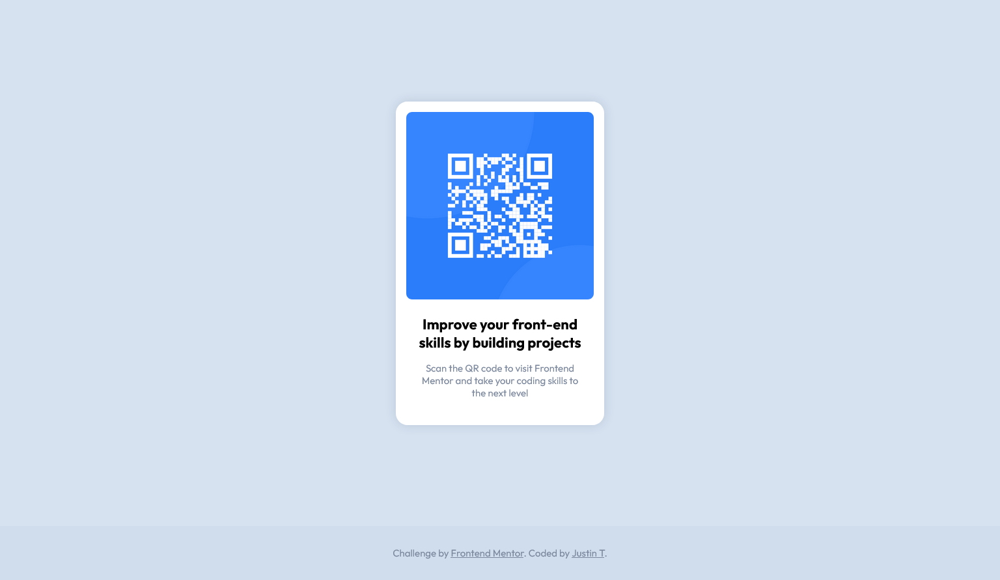

# Frontend Mentor - QR code component solution

This is a solution to the [QR code component challenge on Frontend Mentor](https://www.frontendmentor.io/challenges/qr-code-component-iux_sIO_H). Frontend Mentor challenges help you improve your coding skills by building realistic projects.

## Table of contents

- [Overview](#overview)
  - [Screenshot](#screenshot)
  - [Links](#links)
- [My process](#my-process)
  - [Built with](#built-with)
  - [Comments](#comments)

## Overview

### Screenshot

### Links

- Live Solution URL: [https://juss-10.github.io/qr-code/](https://juss-10.github.io/qr-code/)

## My process

### Built with

- Semantic HTML5 markup
- CSS custom properties
- Flexbox
- CSS Grid

### Comments

- I did not have access to any of the Sketch or Figma files, but I aimed to be as pixel perfect as possible.

- In the provided example images, it looks like there is some padding on the left and right of the text, where the text is not perfectly in line with the image, so I included a wrapping element with padding and then offset this with negative margin for the image wrapper.
